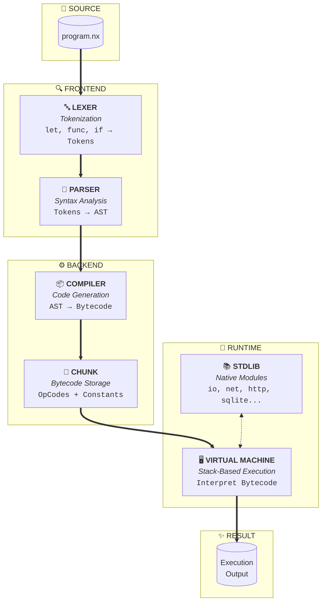

[](CHANGELOG.md)

# Noxy

**A statically typed scripting language where values are copies, sharing is
explicit, and errors are data.**

<p align="center">

</p>

Most scripting languages make you guess: did that function mutate my list?
Is this variable a copy or an alias? Can this call throw? Noxy answers all
three at the type level — and the compiler speaks first.

```noxy
struct Cart
    items: string[]
end

func add_free_gift(c: Cart) -> Cart      // c is a copy: the caller's cart is safe
    append(ref c.items, "gift")
    return c
end

func checkout(c: ref Cart) -> void       // ref: the ONLY way to mutate the caller's value
    append(ref c.items, "receipt")
end

let mine: Cart = Cart(["book"])
let yours: Cart = mine                   // a copy, not an alias
append(ref yours.items, "pen")

let promo: Cart = add_free_gift(mine)    // mine untouched
checkout(ref mine)                       // mine changes — the signature and the call site say so

print(mine.items)    // [book, receipt]
print(yours.items)   // [book, pen]
print(promo.items)   // [book, gift]
```

No hidden aliasing, no defensive `.copy()`, no action at a distance. Copies
are cheap: composites are copy-on-write, so a "copy" costs nothing until
someone actually writes to it.

[Language spec](docs/NOXY_LANGUAGE_SPEC.md) ·
[Showcase](docs/SHOWCASE.md) ·
[Website](https://noxylang.com/)

## Three rules

**1. Variables are values.** Assigning, passing, or returning a struct, array
or map gives you an independent value — at any depth, through every field
that is not `ref`. `ref` is the single, visible mechanism for sharing, and it
is part of the type: written at the call site — `push(ref xs)` — so a call
that can mutate your value looks different from one that cannot; or written
in a struct declaration — `next: ref Node?` — so a value that shares says so
in its type. And a value that may be *absent* says so too: `Node?` is the
only spelling of `null`, a bare `Node` never holds it, and a `Node?` is read
only after a null test — `if n != null then n.valor end` — the compiler
narrows it for you.

```noxy
func push(xs: int[])       // cannot touch the caller's array
func push(xs: ref int[])   // can — and the signature says so

func busca(k: int) -> Node?    // may not find: the type says so
let n = busca(7)
print(n.valor)                 // compile error: 'n' may be null; test it first
```

**2. Errors are values, not exceptions.** A failure that indicates a bug
raises and stops the program. A failure that is *expected* — bad input, wire
data — is a `Result<T>` you branch on or propagate with `try`. Nothing flies
past you silently.

```noxy
use errors select *
use convert select *

let r = to_int_result(input)          // Result<int>
if r.ok then
    print(r.value + 1)                // r.value is int here
else
    print("bad input: " + r.failure.message)
end

func porta(texto: string) -> Result<int>
    let n: int = try to_int_result(texto)   // on failure, returns it to the caller
    return Ok(n)
end
```

**3. Dynamic is explicit.** Static typing everywhere; when you need a dynamic
hole — `any`, a bare `func`, a plugin — you write it down. Generics are
monomorphized at compile time and always inferred, so the type system costs
nothing at runtime.

```noxy
let n: int = 42
n = "text"                    // compile error: expected int, got string

let m = 42                    // same thing, type inferred from the value: m is int
m = "text"                    // compile error — inference is local, not dynamic

let loose: any = 42           // the dynamic hole is spelled out...
loose = "now a string"        // ...and only there does the type move

func first<T>(arr: T[]) -> T
    return arr[0]
end
print(first([3, 1, 2]))       // first<int>, resolved at compile time
print(first(["b", "a"]))      // first<string> — no runtime dispatch
```

## What this buys you

- **Concurrency without data races by construction** — data handed to a
  routine by argument or channel is an independent value. Only `ref`
  (including a closure that captures one) and globals need coordination, and
  all of that is visible in the code.
  ([docs/concurrency.md](docs/concurrency.md))
- **Refactoring you can trust** — a function's signature tells you exactly
  what it can mutate and how it can fail.
- **One rule, everywhere** — file, module, and REPL behave the same.

Noxy compiles to bytecode and runs on a stack-based VM written in Go. The
core is deliberately small — structs, arrays, maps, closures, generics,
routines and channels, `defer` — and the standard library covers the usual
scripting ground (io, net, http, sqlite, json, strings, crypto, time) plus a
[package manager](docs/PACKAGE_MANAGER.md). Performance today sits around
CPython for call-heavy code and is
[measured against every release](benchmarks/RESULTS.md) — without changing
semantics.

### The Zen of Noxy

The philosophy that guides the language and its future decisions — short by
design, in the spirit of the Zen of Python: a compass, not a rulebook. It also
opens the [language spec](docs/NOXY_LANGUAGE_SPEC.md#the-zen-of-noxy).

```text
Simplicity is sophistication.
Typing is safety — and the compiler speaks first.
Dynamic exists, but it is explicit: any says what it is.
Variables are copies, unless explicitly stated otherwise.
Sharing is ref — in the type and at the call site. Closures and globals share by name; nothing else does.
CoW + ref is one heck of a duo!
An error is a value, not an exception.
One rule, everywhere: file, module, REPL.
Consistency comes before performance.
Performance is measured afterwards — without changing semantics.
Lean core, vast ecosystem.
Fixing beats staying compatible, until 1.0 says otherwise.
```

### Features

- ✅ Bytecode compiler
- ✅ High-performance stack-based VM
- ✅ Primitive types: `int`, `float`, `string`, `bool`, `bytes`
- ✅ Local type inference in `let` (`let x = 10` binds `x: int`; annotations stay mandatory in signatures and struct fields)
- ✅ Structs with typed fields (global and local scope)
- ✅ Dynamic arrays with `append`, `pop`, `contains`
- ✅ Maps (hashmaps) with literals `{key: value}`
- ✅ Functions with recursion
- ✅ Explicit references (`ref x` to create, `*r` to read, `ref` at every call site)
- ✅ Null safety: `T?` is the only nullable type, a bare `T` never holds `null`, and `if x != null then` narrows (Kotlin-style flow typing)
- ✅ Errors as data: one generic `Result<T>` with `Ok`/`Err`, `if r.ok then` narrows `r.value`, `try expr` propagates the failure
- ✅ Every global name resolves at compile time; `let`, `func`, `struct` and imports share one namespace
- ✅ F-strings with interpolation
- ✅ Single and double quote support
- ✅ Line tracking for debugging
- ✅ SQLite database support (Thread-safe)
- ✅ HTTP server support
- ✅ Value semantics with copy-on-write (composites are independent values; `ref` is the only sharing mechanism)
- ✅ First-class functions
- ✅ Closures
- ✅ Generics with zero runtime cost (monomorphization: `func first<T>(arr: T[]) -> T`, `struct Stack<T>`, always inferred from usage)
- ✅ Concurrency (noxy routines) [docs/concurrency.md](docs/concurrency.md)
- ✅ Garbage collection
- ✅ Built-in modules (io, net, http, sqlite)
- ✅ Package manager (see [docs/PACKAGE_MANAGER.md](docs/PACKAGE_MANAGER.md))

## Installation

```bash
# Clone the repository
git clone https://github.com/estevaofon/noxy.git
cd noxy-vm

# Build
go build -o noxy ./cmd/noxy

# Or run directly
go run ./cmd/noxy/main.go file.nx
```

## Usage

```bash
# Run a Noxy program
./noxy program.nx

# Or with go run
go run ./cmd/noxy/main.go program.nx

# Start Interactive REPL
./noxy

# Diagnostics go to stderr — redirect to capture them with the program output
./noxy program.nx > out.txt 2>&1
```

The program's own output (`print`, `iprint`) goes to **stdout**; everything the
VM/CLI reports — parser, compiler and runtime errors, hints, "Error reading
file" — goes to **stderr**. A failing run (including a missing script file)
exits with code `1`.

## Interactive REPL

Noxy includes a powerful REPL (Read-Eval-Print Loop) for interactive coding. Just run `noxy` without arguments.

```noxy
Noxy REPL v0.23.0
Type 'exit' to quit.
>>> let x: int = 10
>>> x + 5
15
>>> if true then
...     print("Multiline support!")
... end
Multiline support!
```

On Linux and macOS the REPL edits the line in place: ←/→ move the cursor,
↑/↓ walk the session history, Home/End, Ctrl-A/E/K/U/W/L behave as in
readline; Ctrl-C quits the REPL (as it always did) and so does Ctrl-D or
`exit`. On Windows the console provides the same through its own line editing.

## Quick Example

```noxy
func main()
    let x: int = 10
    let y: int = 20
    print(f"Sum: {x + y}")

    struct Person
        name: string
        age: int
    end

    let p: Person = Person("Ana", 25)
    print(p.name)

    // Dynamic arrays
    let nums: int[] = []
    append(ref nums, 1)
    append(ref nums, 2)
    print(f"Length: {length(nums)}")

    // Maps
    let scores: map[string, int] = {"Alice": 100, "Bob": 95}
    print(f"Alice: {scores['Alice']}")
end
main()
```

Output:
```
Sum: 30
Ana
Length: 2
Alice: 100
```

## Testing
 
How to run the interpreter tests:
 
```bash
# Run all unit tests (Lexer, Parser, Compiler, VM)
go test ./...
 
# Run integration tests (Noxy scripts)
go run cmd/noxy/main.go noxy_examples/run_all_tests_concurrent.nx
```
 
## Architecture

```
noxy-vm/
├── cmd/noxy/main.go      # Main CLI
├── internal/
│   ├── lexer/            # Tokenization
│   ├── token/            # Token types
│   ├── parser/           # Recursive descent parser → AST
│   ├── ast/              # AST nodes
│   ├── compiler/         # AST → Bytecode Compiler
│   ├── chunk/            # Bytecode and operations
│   ├── value/            # Value system (int, float, string, etc.)
│   └── vm/               # Stack-based virtual machine
```


```mermaid
flowchart TB
    subgraph INPUT["📄 SOURCE"]
        A[("program.nx")]
    end

    subgraph FRONTEND["🔍 FRONTEND"]
        direction TB
        B["🔤 <b>LEXER</b><br/><i>Tokenization</i><br/><code>let, func, if → Tokens</code>"]
        C["🌳 <b>PARSER</b><br/><i>Syntax Analysis</i><br/><code>Tokens → AST</code>"]
    end

    subgraph BACKEND["⚙️ BACKEND"]
        direction TB
        D["📦 <b>COMPILER</b><br/><i>Code Generation</i><br/><code>AST → Bytecode</code>"]
        E["💾 <b>CHUNK</b><br/><i>Bytecode Storage</i><br/><code>OpCodes + Constants</code>"]
    end

    subgraph RUNTIME["🚀 RUNTIME"]
        direction TB
        F["🖥️ <b>VIRTUAL MACHINE</b><br/><i>Stack-Based Execution</i><br/><code>Interpret Bytecode</code>"]
        G["📚 <b>STDLIB</b><br/><i>Native Modules</i><br/><code>io, net, http, sqlite...</code>"]
    end

    subgraph OUTPUT["✨ RESULT"]
        H[("Execution<br/>Output")]
    end

    A ==> B
    B ==> C
    C ==> D
    D ==> E
    E ==> F
    G <-.-> F
    F ==> H
```

## Data Types

### Primitives
```noxy
let x: int = 42
let pi: float = 3.14159
let name: string = "Noxy"
let active: bool = true
let data: bytes = b"hello"

// The annotation can be omitted when the initializer has a single static
// type — the variable is still type-stable (x is int, for good):
let total = x + 8          // total: int
let label = "v" + name     // label: string
```

### Dynamic Arrays
```noxy
let nums: int[] = []
append(ref nums, 10)
append(ref nums, 20)
print(length(nums))     // 2
print(pop(ref nums))    // 20
print(contains(nums, 10)) // true
```

### Maps
```noxy
let scores: map[string, int] = {"Alice": 100, "Bob": 95}
scores["Charlie"] = 88
print(has_key(scores, "Alice"))  // true
print(scores["Alice"])           // 100
```

### Bytes
```noxy
let b: bytes = b"hello"
print(b[0])  // 104 (ASCII 'h')

let from_str: bytes = to_bytes("text")
let from_int: bytes = to_bytes(65)  // b"A"
```

### Generics

Generic functions and structs are monomorphized at compile time — zero
runtime cost, always instantiated by inference (no explicit `first<int>(x)`
syntax). See [NOXY_LANGUAGE_SPEC.md §6](docs/NOXY_LANGUAGE_SPEC.md) for the
full contract.

```noxy
struct Stack<T>
    items: T[]
end

func push<T>(s: ref Stack<T>, item: T)
    append(ref s.items, item)
end

func peek<T>(s: Stack<T>) -> T
    return s.items[length(s.items) - 1]
end

let ints: Stack<int> = Stack([])   // T inferred from the `let` annotation
push(ref ints, 10)
push(ref ints, 20)
print(peek(ints))  // 20
```

## Builtin Functions

| Function | Description |
|--------|-----------|
| `print(expr)` | Prints value to stdout |
| `eprint(expr)` | Prints value to stderr |
| `input(prompt)` | Reads one line from stdin (`""` at end of input) |
| `fmt(format, args...)` | printf-style formatting (`%s`, `%d`, `%.2f`, ...) |
| `to_str(val)` | Converts to string |
| `length(arr)` | Length of array/string |
| `append(ref arr, val)` | Appends element to array |
| `pop(ref arr)` | Removes and returns last element |
| `contains(arr, val)` | Checks if value exists |
| `has_key(map, key)` | Checks if key exists in map |
| `to_bytes(val)` | Converts string/int/array to bytes |
| `zeros(n)` | Array of n zeros |
| `range(stop)`, `range(start, stop, step)` | Integer sequence as `int[]` (Python semantics, no import) |
| `time_now()` | Current timestamp in ms |

## VM Opcodes

The VM uses the following main opcodes:

| Opcode | Description |
|--------|-----------|
| `OP_CONSTANT` | Loads constant |
| `OP_ADD/SUB/MUL/DIV` | Arithmetic operations |
| `OP_EQUAL/LESS/GREATER` | Comparisons |
| `OP_JUMP/JUMP_IF_FALSE` | Flow control |
| `OP_CALL/RETURN` | Function calls |
| `OP_ARRAY/OP_MAP` | Collection creation |
| `OP_GET_INDEX/SET_INDEX` | Index access |

## Disassembly

The compiler generates bytecode that can be visualized:

```
== main ==
0000    1 OP_CONSTANT         0 '<fn main>'
0002    | OP_SET_GLOBAL       1 'main'
0004    | OP_POP
0005    | OP_GET_GLOBAL       2 'main'
0007    | OP_CALL             0

== main ==
0000    3 OP_CONSTANT         0 '10'
0002    | OP_CONSTANT         1 '20'
0004    5 OP_GET_LOCAL        1
...
```

## Performance

Measured, not promised: every release is benchmarked against the previous
one and against CPython, Lua and Go on the same machine, with an interleaved
protocol — see [benchmarks/RESULTS.md](benchmarks/RESULTS.md). As of 0.16.0,
call-heavy code (`fib`) runs at about 1.2x CPython and arithmetic loops at
about 1.06x; performance work never changes language semantics.

## License

MIT License

---

*Noxy — values are copies, sharing is `ref`, errors are data. Implemented in Go.*
