# Noxy VM 🚀

A complete bytecode virtual machine for the **Noxy** programming language, written in Go. [Official Website.](https://noxylang.com/)

<p align="center">

</p>

## What is Noxy VM?

Noxy VM is a bytecode compiler and virtual machine for the Noxy language created by Estevão Fonseca. This implementation compiles source code into bytecode and executes it on a stack-based VM, offering high performance.

### Features

- ✅ Bytecode compiler
- ✅ High-performance stack-based VM
- ✅ Primitive types: `int`, `float`, `string`, `bool`, `bytes`
- ✅ Structs with typed fields (global and local scope)
- ✅ Dynamic arrays with `append`, `pop`, `contains`
- ✅ Maps (hashmaps) with literals `{key: value}`
- ✅ Functions with recursion
- ✅ Reference system (`ref`)
- ✅ F-strings with interpolation
- ✅ Single and double quote support
- ✅ Line tracking for debugging

## Installation

```bash
# Clone the repository
git clone <repo-url>
cd noxy-vm

# Build
go build -o noxy ./cmd/noxy

# Or run directly
go run ./cmd/noxy/main.go file.nx
```

## Usage

```bash
# Run a Noxy program
./noxy program.nx

# Or with go run
go run ./cmd/noxy/main.go program.nx
```

## Quick Example

```noxy
func main()
    let x: int = 10
    let y: int = 20
    print(f"Sum: {x + y}")

    struct Person
        name: string
        age: int
    end

    let p: Person = Person("Ana", 25)
    print(p.name)

    // Dynamic arrays
    let nums: int[] = []
    append(nums, 1)
    append(nums, 2)
    print(f"Length: {length(nums)}")

    // Maps
    let scores: map[string, int] = {"Alice": 100, "Bob": 95}
    print(f"Alice: {scores['Alice']}")
end
main()
```

Output:
```
Sum: 30
Ana
Length: 2
Alice: 100
```

## Testing
 
How to run the interpreter tests:
 
```bash
# Run all unit tests (Lexer, Parser, Compiler, VM)
go test ./...
 
# Run integration tests (Noxy scripts)
go run cmd/noxy/main.go noxy_examples/run_all_tests.nx
```
 
## Architecture

```
noxy-vm/
├── cmd/noxy/main.go      # Main CLI
├── internal/
│   ├── lexer/            # Tokenization
│   ├── token/            # Token types
│   ├── parser/           # Recursive descent parser → AST
│   ├── ast/              # AST nodes
│   ├── compiler/         # AST → Bytecode Compiler
│   ├── chunk/            # Bytecode and operations
│   ├── value/            # Value system (int, float, string, etc.)
│   └── vm/               # Stack-based virtual machine
```



```mermaid
flowchart TB
    subgraph INPUT["📄 SOURCE"]
        A[("program.nx")]
    end

    subgraph FRONTEND["🔍 FRONTEND"]
        direction TB
        B["🔤 <b>LEXER</b><br/><i>Tokenization</i><br/><code>let, func, if → Tokens</code>"]
        C["🌳 <b>PARSER</b><br/><i>Syntax Analysis</i><br/><code>Tokens → AST</code>"]
    end

    subgraph BACKEND["⚙️ BACKEND"]
        direction TB
        D["📦 <b>COMPILER</b><br/><i>Code Generation</i><br/><code>AST → Bytecode</code>"]
        E["💾 <b>CHUNK</b><br/><i>Bytecode Storage</i><br/><code>OpCodes + Constants</code>"]
    end

    subgraph RUNTIME["🚀 RUNTIME"]
        direction TB
        F["🖥️ <b>VIRTUAL MACHINE</b><br/><i>Stack-Based Execution</i><br/><code>Interpret Bytecode</code>"]
        G["📚 <b>STDLIB</b><br/><i>Native Modules</i><br/><code>io, net, http, sqlite...</code>"]
    end

    subgraph OUTPUT["✨ RESULT"]
        H[("Execution<br/>Output")]
    end

    A ==> B
    B ==> C
    C ==> D
    D ==> E
    E ==> F
    G <-.-> F
    F ==> H
```

## Data Types

### Primitives
```noxy
let x: int = 42
let pi: float = 3.14159
let name: string = "Noxy"
let active: bool = true
let data: bytes = b"hello"
```

### Dynamic Arrays
```noxy
let nums: int[] = []
append(nums, 10)
append(nums, 20)
print(length(nums))     // 2
print(pop(nums))        // 20
print(contains(nums, 10)) // true
```

### Maps
```noxy
let scores: map[string, int] = {"Alice": 100, "Bob": 95}
scores["Charlie"] = 88
print(has_key(scores, "Alice"))  // true
print(scores["Alice"])           // 100
```

### Bytes
```noxy
let b: bytes = b"hello"
print(b[0])  // 104 (ASCII 'h')

let from_str: bytes = to_bytes("text")
let from_int: bytes = to_bytes(65)  // b"A"
```

## Builtin Functions

| Function | Description |
|--------|-----------|
| `print(expr)` | Prints value |
| `to_str(val)` | Converts to string |
| `length(arr)` | Length of array/string |
| `append(arr, val)` | Appends element to array |
| `pop(arr)` | Removes and returns last element |
| `contains(arr, val)` | Checks if value exists |
| `has_key(map, key)` | Checks if key exists in map |
| `to_bytes(val)` | Converts string/int/array to bytes |
| `zeros(n)` | Array of n zeros |
| `time_now()` | Current timestamp in ms |

## VM Opcodes

The VM uses the following main opcodes:

| Opcode | Description |
|--------|-----------|
| `OP_CONSTANT` | Loads constant |
| `OP_ADD/SUB/MUL/DIV` | Arithmetic operations |
| `OP_EQUAL/LESS/GREATER` | Comparisons |
| `OP_JUMP/JUMP_IF_FALSE` | Flow control |
| `OP_CALL/RETURN` | Function calls |
| `OP_ARRAY/OP_MAP` | Collection creation |
| `OP_GET_INDEX/SET_INDEX` | Index access |

## Disassembly

The compiler generates bytecode that can be visualized:

```
== main ==
0000    1 OP_CONSTANT         0 '<fn main>'
0002    | OP_SET_GLOBAL       1 'main'
0004    | OP_POP
0005    | OP_GET_GLOBAL       2 'main'
0007    | OP_CALL             0

== main ==
0000    3 OP_CONSTANT         0 '10'
0002    | OP_CONSTANT         1 '20'
0004    5 OP_GET_LOCAL        1
...
```

## Performance

The bytecode VM offers high performance, especially for:
- Intensive loops
- Recursive function calls
- Operations with large arrays

## License

MIT License

---

*Bytecode implementation of the Noxy language in Go.*
